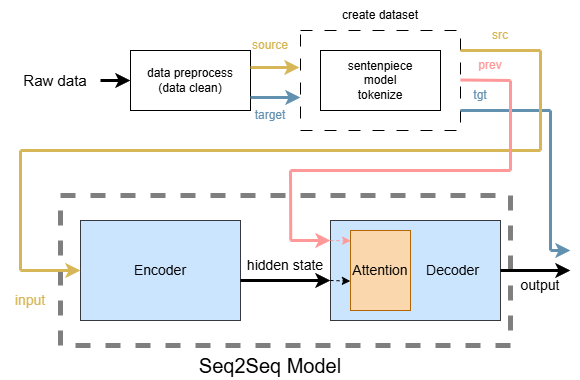
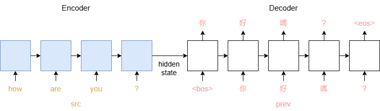
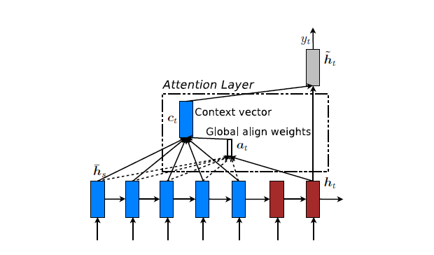
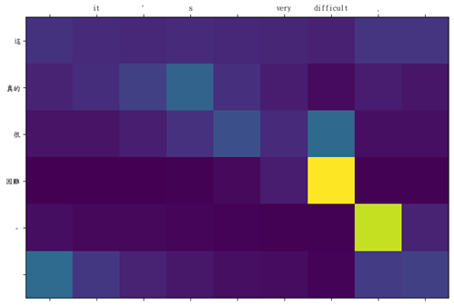

## Seq2Seq Translation
### Process Architecture

 
Process:
1. Data preprocessing, cleaning(dataclean.ipynb)
2. Build dataset
    * Use sentencepiece model to tokenize sentences and perform encoding
3. Input into Seq2Seq model
 

### Seq2Seq Model

 
* Encoder: The src (input language) data is sequentially input into the RNN-based encoder, obtaining a hidden state containing time information.
* Decoder: The hidden state is passed into the RNN-based decoder, and the prev (token of the target language at the previous moment, starting from bos)
  is sequentially input to predict the subsequent target language.
* The prediction result will be compared with tgt (the token of the target language at this moment) for model training.
 

### Attention
Image sourced from the internet, global attention
 
* Decoder contains attention layer, which is important for finding out which part of the input language needs to be focused on when translating the target language at that moment.
* It builds relationship between the hidden state related to src (from Encoder) and the hidden state of prev (which may have gone through embed or neural network).
  Using methods such as matrix multiplication, or concat the hidden states and process by neural network.
* This relationship will generate a set of scores, which can indicate whether to focus on the token at a certain position of src,
  and use this score as the weight to multiply with the hidden state transmitted by the encoder, thereby affecting the translation result of the model.
 
The translation and attention are as shown in the figure below. You can observe which English token will be focused on when translating English into Chinese: 

