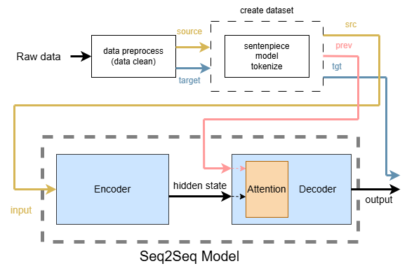
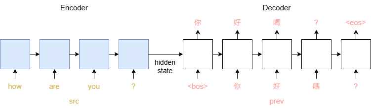

## Seq2Seq翻譯
### 流程架構

 
主要流程:
1. 資料前處理、清理(dataclean.ipynb)
2. 建dataset
    * 使用sentencepiece model將語句tokenize，並進行編碼
3. 輸入Seq2Seq模型
 

### Seq2Seq模型運作

 
* Encoder: src(輸入語言)資料依序輸入進RNN-base encoder，得到內含時間資訊的hidden state。
* Decoder: hidden state傳入RNN-base decoder，並依序輸入prev(目標語言上一個時刻的token，從bos開始)，以此預測出接續的目標語言。
* 預測結果將與tgt(目標語言此時刻的token)進行比對，以此訓練模型。
 

### Attention
